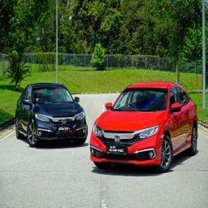
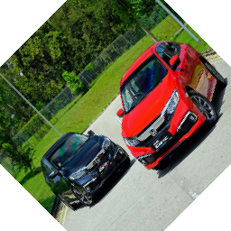
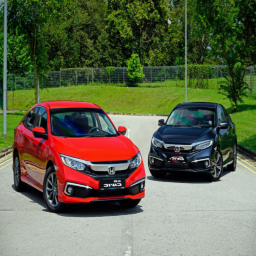
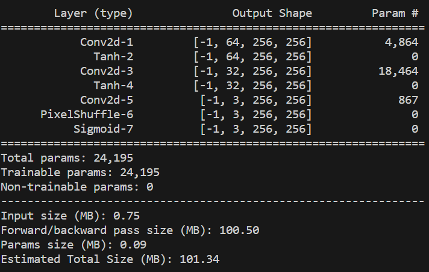
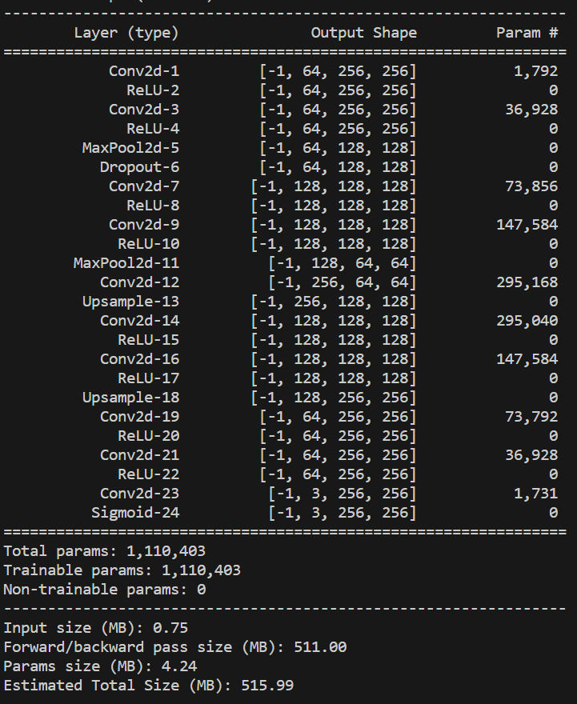
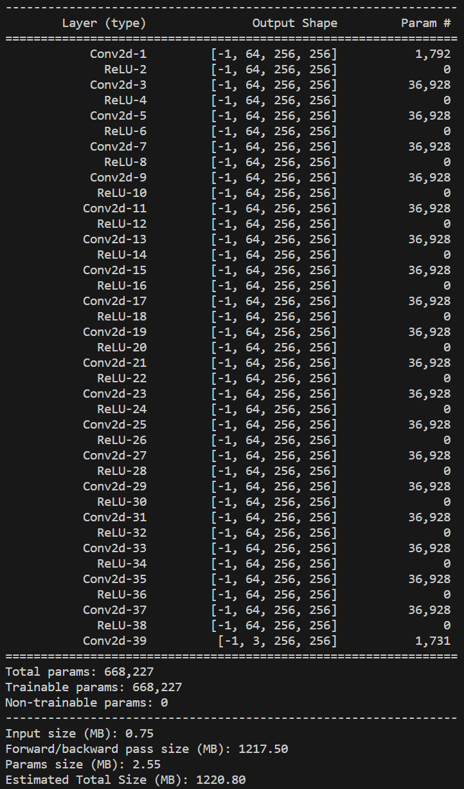
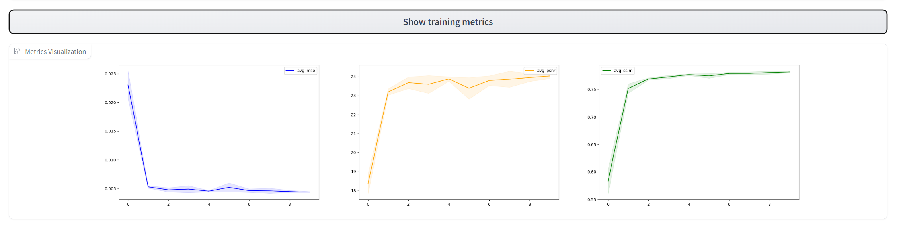
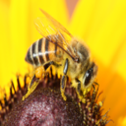
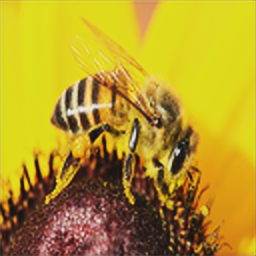

# Super-Resolution Experiment Report
## Authors
- Tymon Dydowicz 151936
- Wojciech Cieśla 151957

## Introduction

In this Computer Vision project we were supposed to choose and solve one of interesting problems with the use of Nerual Networks.  
We decided to solve the problem of Super-Resolution due to it's interesting character, however we quickly found out it's not a simple task.  
The problem of super resolution is to reconstruct a high resolution image from a low resolution image. To solve this we created few nerual networks and trained them on a dataset of images.   This results in the network understanding how to fill in the missing details in the low resolution image.  
If you are interested to run this experiment on your own or use it for your own purpose. All required libraries are in [`requirements.txt`](./requirements.txt) file.  
You also can download a docker image with all required libraries from [here](https://hub.docker.com/repository/docker/lefna/computer_vision/general). Said container will have port 7860 exposed to easily access Gradio so make sure it's not occupied when running the container.  
To run the experiment you need to run the [`main.py`](./main.py) file while being in the /app folder .  

To see the finished requirements of the project you can refer to the [`checklist.md`](./checklist.md) file.  

## Methodology

### Dataset
For our dataset we chose the [`Image Super Resolution (ISR)`](https://www.kaggle.com/datasets/adityachandrasekhar/image-super-resolution) dataset which is easily available on the kaggle website. The dataset consisted of total of 1710 256x256 images, which were divided into 2 folders: high_res containing the high resolution images and low_res containing the low resolution images. Totaling 855 images in each folder.
To avoid RAM bloating we only URLs of the images to the dataset and later we only load the images when they are processed as a batch. To choose the wanted images to perform the experiment you need to provide paths to all desired directories with prepared high_res folder and optionally low_res folder (it will be derived from high_res if it's not present), to the [`DataManager`](./app/DataManager.py) object build function  
Example images from the dataset:  
High Resolution:  

 
Low Resolution Image:  
  

#### Data Augmentation
To further increase the size of our dataset we decided to use data augmentation with 2 different methods:  

 
However what we later learned is that due to large amounts of empty space in the rotation images, they tend to greatly decrease the performance of the network.  

### Models Used
After doing some research we found that architectures often used to solve the problem of super resolution are Autoencoders, Efficient Sub-Pixel Convolutional Neural Networks (ESPCN) and Very Deep Super Resolution (VDSR).  
We decided to implement all 3 of them by hand and train them on our dataset instead of using pretrained models.  
For more details you can refer to the respective python file where each model has it's definition. 

- [`ESPCN`](app/Models.py) 

- [`Autoencoder`](app/Models.py) 

- [`VDSR`](app/Models.py) 

### Training

The training process is implemented in the [`trainModel`](app/ModelManager.py) or ['trainKFold'](app/ModelManager.py) function. trainModel is a simple function that only needs to get the model which is supposed to be trained, loss function, optimizer and the number of epochs as well as the training dataLoader class from pyTorch containing the training data. Kfold additonally will require the number of folds and instead of ready dataLoader it will need the training Dataset. It additionally needs to be passed a model class definition instead of model instance to work properly due to the need to retrain the model for each fold.  

Hyperparameters used in the training process include learning rates, L2 regularization values, number of convolution blocks, and number of channels. The function also allows for the selection of loss functions and optimizers. But due to long execution times of this process we only ran it for MSE loss and Adam optimizer to determine best parameters for ESPCN  
The determined best parameters for ESPCN are:  
- Learning Rate: 0.001
- L2 Regularization: 0.0001
- Number of Convolution Blocks: 2
- Number of Channels: 64
Which goes to our hand because it's also the smallest model 

#### Times
Training was a very long process due to the large number of combinations of loss functions and optimizers for a given model which totaled to 27 models. Each KFOLD training took around 25 minutes on ~700 images for MSE and MAE loss functions and 125 minutes with VGG loss. But due to the model sizes the inference is quite light and fast. Due to the long time of KFOLD learning i decided to train only ESPCN with it. 
Our Biggest model Autoencoder with ~1.1M parameters trained for slighlty over 5 hours on the small dataset of 700 images.  
VDSR with ~660K parameters trained for _ hours  
Inference times: ~0.02s per 256x256 image

### Utilities

The [`GUIImageProcessor`](app/Utils.py) class is used for processing images through the models. It loads the models from a specified directory and provides a method for processing an image through a specified model.

The [`VGGPerceptualLoss`](app/Utils.py) class is a custom loss function used in the training process.

## Results

Here are few results of the ESPCN model. For more you can view them on gradio demo by selecting the desired model and pressing the "Show Training Metrics" button.

## References

https://medium.com/@zhuocen93/an-overview-of-espcn-an-efficient-sub-pixel-convolutional-neural-network-b76d0a6c875e

https://www.kaggle.com/code/quadeer15sh/image-super-resolution-using-autoencoders

https://arxiv.org/pdf/2209.11345.pdf